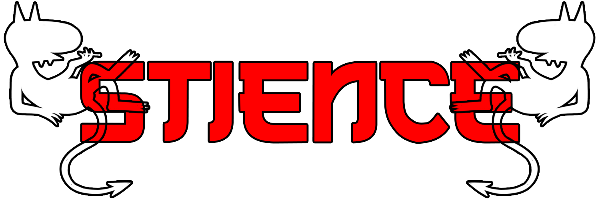

<h1 align="center">
    
    <br />
    Stience
</h1>

<p align="center">
    <b>Stience CLI is currently in an early alpha state, which means it may break.</b>
</p>

Stience is a web development and maintenance CLI created for developers to better focus on their project, not the setup.

Stience is many things (or will eventually become many things), but some of the current features are containerized package and dependecy management and package installation to a local modules directory. Stience was created to assist developers with maintaining and optimizing their local development environment. Stience CLI currently uses a Docker approach, offering a custom Docker container for `node_modules` available over a network connection. The architecture is simple. The CLI currently offers two seperate commands, install and dock. The install command works just like `npm` or `yarn`, it installs packages based on the `package.json` file and then populates the `node_modules` directory. The dock command builds a Docker container and boots up a local server hosting the `node_modules` on port 1337.

This will host the `node_modules` under `http://localhost:1337/node_modules`.

The current version of the CLI requires a Dockerfile in the same directory.

### Usage

NOTE: All versions prior to `v0.0.7` will not work.

Install the CLI tool globally:
```bash
npm install stience@latest -g
```

Depending on how you have your PATH configured, you can run Stience by using npx or directly:
```bash
# Example 1
stience install <PackageName>

# Example 2
npx stience install <PackageName>
```

If creating a docker server, you can run it like so:
```bash
# Example 1
stience dock

# Example 2
npx stience dock
```

If you already have a `package.json` file present, you can just run install like normal:
```bash
stience install
```
